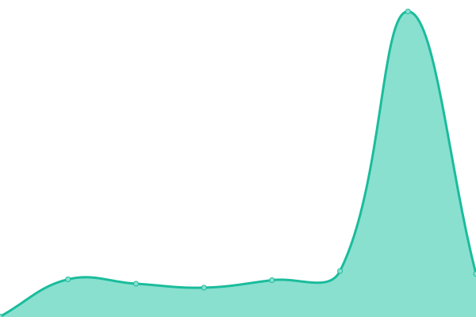
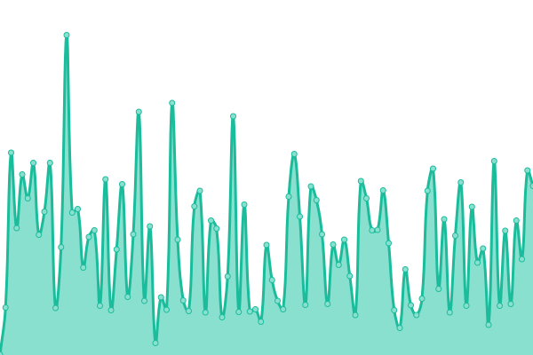

# [📈 Live Status](https://budlebee.github.io/upptime-kundera): <!--live status--> **🟧 Partial outage**

This repository contains the open-source uptime monitor and status page for [budlebee](https://budlebee.wordpress.com), powered by [Upptime](https://github.com/upptime/upptime).

With [Upptime](https://upptime.js.org), you can get your own unlimited and free uptime monitor and status page, powered entirely by a GitHub repository. We use [Issues](https://github.com/budlebee/upptime-kundera/issues) as incident reports, [Actions](https://github.com/budlebee/upptime-kundera/actions) as uptime monitors, and [Pages](https://budlebee.github.io/upptime-kundera) for the status page.

<!--start: status pages-->
<!-- This summary is generated by Upptime (https://github.com/upptime/upptime) -->
<!-- Do not edit this manually, your changes will be overwritten -->
<!-- prettier-ignore -->
| URL | Status | History | Response Time | Uptime |
| --- | ------ | ------- | ------------- | ------ |
|  [Kundera](https://kundera.so) | 🟩 Up | [kundera.yml](https://github.com/budlebee/upptime-kundera/commits/HEAD/history/kundera.yml) | 

 212ms
     
 | 

<a href="https://budlebee.github.io/upptime-kundera/history/kundera">100.00%</a>
    

|  [Foresty](https://foresty.net) | 🟥 Down | [foresty.yml](https://github.com/budlebee/upptime-kundera/commits/HEAD/history/foresty.yml) | 

 0ms
     
 | 

<a href="https://budlebee.github.io/upptime-kundera/history/foresty">0.00%</a>
    

|  [Videoglancer](https://videoglancer.com) | 🟩 Up | [videoglancer.yml](https://github.com/budlebee/upptime-kundera/commits/HEAD/history/videoglancer.yml) | 

 268ms
     
 | 

<a href="https://budlebee.github.io/upptime-kundera/history/videoglancer">64.40%</a>
    

<!--end: status pages-->

[**Visit our status website →**](https://budlebee.github.io/upptime-kundera)

## 📄 License

- Powered by: [Upptime](https://github.com/upptime/upptime)
- Code: [MIT](./LICENSE) © [budlebee](https://budlebee.wordpress.com)
- Data in the `./history` directory: [Open Database License](https://opendatacommons.org/licenses/odbl/1-0/)
